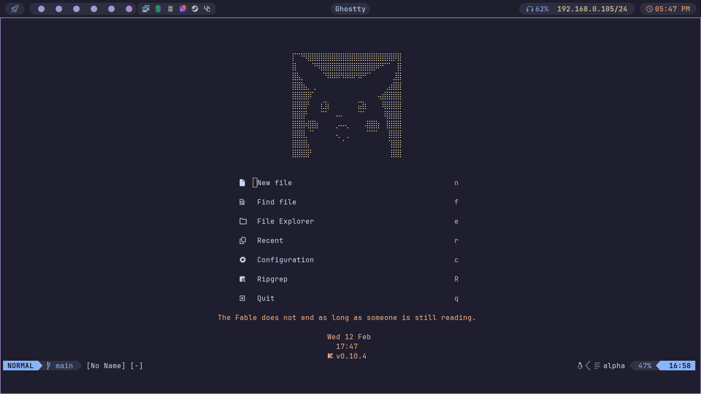
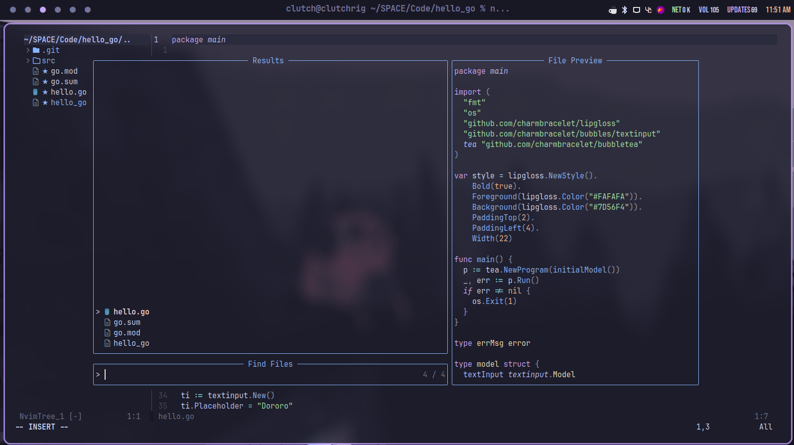

# My Neovim Configuration




** Note this repo is highly personalised you may have to change keybinding etc. according to your taste**
# To Use 

1. Clone this repo to nvim folder
```
git clone https://github.com/Clutchnp/myvim ~/.config/nvim
```
2. Enjoy


